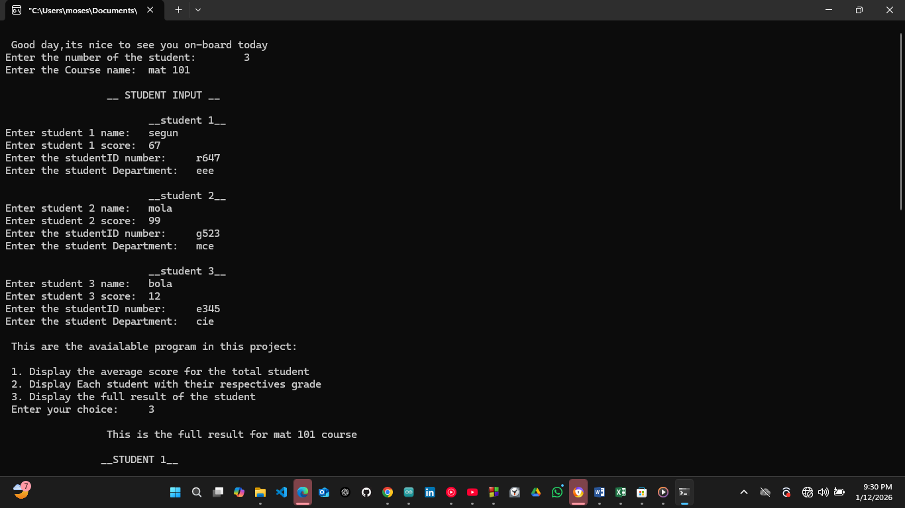

# Student Score Grading System Using Header Files – C Project

## Overview
This project is about creating a student grading system in C using multiple header files.
I wanted to give up while writing it, but I told myself I must finish it. It took me about 5 hours, but I was able to complete it. 
The main goal is to manage student details, calculate average scores, assign grades, and display full results.

## Project Description
In this project, the user enters the number of students and the course name. 
Then the program asks for each student’s name, score, student ID, and department.

The program allows the user to:
  - Display the average score of all students
  - Display each student with their grade
  - Display the full result of all students

I used header files to separate the code into different parts: one for student structure, one for calculation functions, and one for grading functions. Using structs in header files was a bit tricky because I realized I needed to use pointers to pass the data between files correctly.

## Project Structure

 - main.c → handles user input, menu, and program flow [Click Here for the Link](Source_Code/main.c)
   
 - student.h [Click for code](Header_File/student.h) / student.c [Click for code](Source_Code/student.c) → contains the student struct and input function
   
 - calc.h  [Click for code](Header_File/calc.h)/ calc.c [Click For Code](Source_Code/calc.c) → contains average calculation, result display, and full result functions

  
 - score_grader.h  [Click for code](Header_File/score_grader.h)  / score_grader.c [Click For Code](Source_Code/score_grader.c) → contains the grader function

## Why Header Files
I used header files so I can split the project into smaller, reusable files. This makes the code cleaner and easier to maintain. 
Each function has its own file, which helped me organize the project properly. Include guards (#ifndef, #define, #endif) prevent multiple declarations.

## How the Code Works

The program starts from main()

Standard libraries and custom header files are included

- User enters the number of students and the course name
- Student details are input using the inputed_details() function
- A menu is displayed with three options: average score, student grades, full results
- Based on the user’s choice, the program calls the correct function using pointers to access the student array
- The function performs the task and prints the result
- The program asks if the user wants to continue. If yes, it repeats; if no, it ends

## What I Learned

- How to use structs in header files
- How to use pointers to pass struct arrays between files
- How to separate code into multiple header and source files
- How to calculate averages, assign grades, and display structured results
- How to organize a bigger C project for readability and reusability

## Images / Demo Video

[Click Here for other images](images/)

## Embedded Systems Connection
This system can be useful in embedded projects that handle student data or scores on a display. For example, it could be used in school attendance systems, scoreboards, or other systems that need structured data handling.
